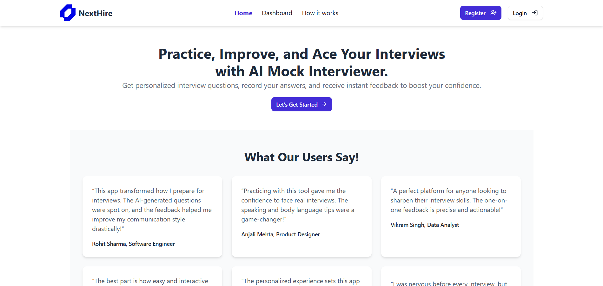
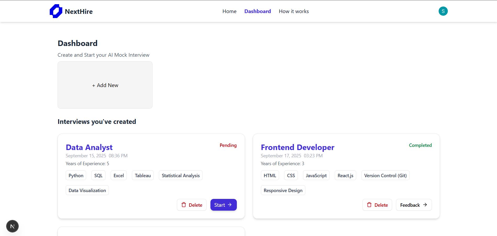
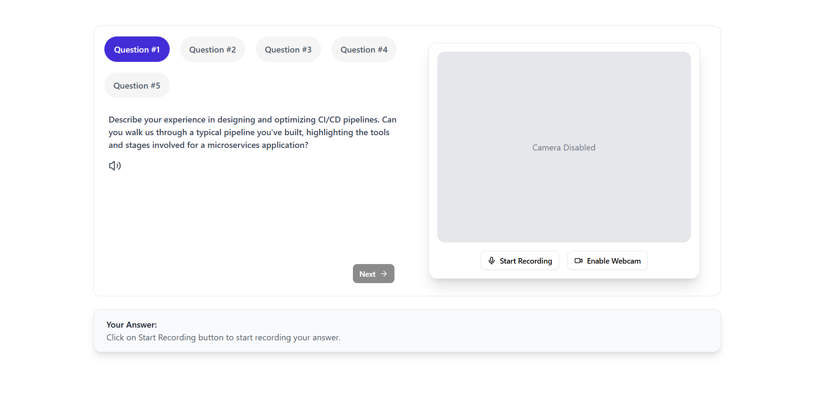
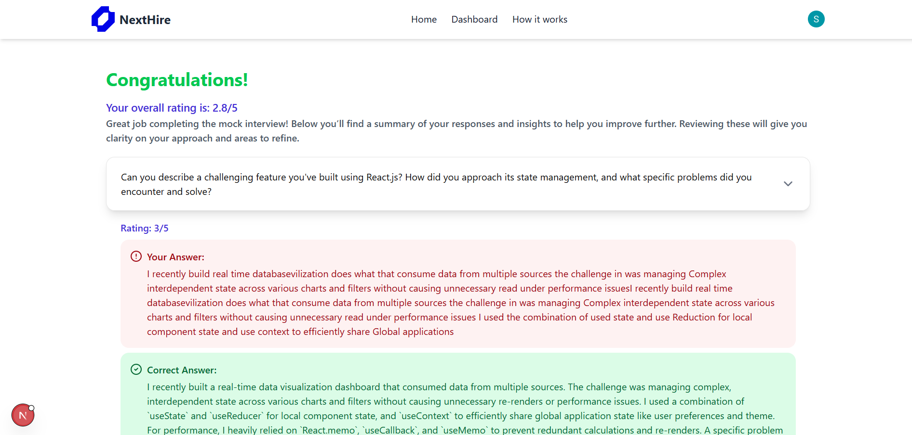

# 🤖 NextHire – Prepare yourself for your next big opportunity.

The **NextHire** is an AI-powered platform where users can create customized interview sessions, answer AI-generated questions, and receive instant feedback for improvement.  
It helps job seekers **practice interviews** in a realistic environment and improve their performance.

---

## ✨ Features

### 🎯 Core Functionalities
- **User Authentication**
  - Secure sign-up/login using [Clerk](https://clerk.com/) authentication.
- **Interview Session Creation**
  - Create new interview sessions by providing:
    - Job Role
    - Job Description
    - Required Skills
    - Years of Experience
- **AI-Generated Questions**
  - Get **five AI-generated interview questions** tailored to the provided job details.
- **Answer Submission**
  - Each question can be answered **only once**.
  - All answers are saved securely to the database.
- **AI Feedback**
  - After all questions are answered, receive **overall AI-generated feedback** with actionable improvement tips.

---

## 🏗️ Tech Stack

| Layer         | Technologies |
|---------------|--------------|
| **Frontend**  | [Next.js](https://nextjs.org/) • [Tailwind CSS](https://tailwindcss.com/) • [Shadcn](https://ui.shadcn.com/) |
| **Backend**   | [Next.js API Routes](https://nextjs.org/docs/api-routes/introduction) |
| **Database**  | [MongoDB](https://www.mongodb.com/) • [Mongoose](https://mongoosejs.com/) |
| **AI Engine** | [Google Gemini AI](https://ai.google/) |
| **Auth**      | [Clerk](https://clerk.com/) |

---

## ⚡ How It Works
1. **Login/Register**  
   Users authenticate via Clerk for secure sign-up and login.
2. **Create Interview**  
   Provide job details (role, description, skills, and experience) to start a session.
3. **Answer Questions**  
   - The system generates 5 job-specific questions using **Google Gemini AI**.
   - Each question can only be answered once.
4. **Get Feedback**  
   Once all answers are submitted, the AI provides a detailed **feedback report** with suggestions for improvement.

---

## 🔑 Environment Variables

Create a `.env` file in the root directory and add the following:

```env
NEXT_PUBLIC_CLERK_PUBLISHABLE_KEY=your_clerk_publishable_key
CLERK_SECRET_KEY=your_clerk_secret_key

NEXT_PUBLIC_CLERK_SIGN_IN_URL=/sign-in
NEXT_PUBLIC_CLERK_SIGN_UP_URL=/sign-up

NEXT_PUBLIC_MONGO_URI=your_mongodb_connection_string

NEXT_PUBLIC_GEMINI_API_KEY=your_gemini_api_key

NEXT_PUBLIC_INTERVIEW_QUESTIONS_COUNT=5

NEXT_PUBLIC_INFORMATION="Welcome to the mock interview platform! Enable your Web cam and Microphone to record your answers. There will be 5 interview questions displayed which you have to answer according to the best of your knowledge. After you’ve answered all the questions, you will receive a detailed report with feedback on your performance."
NEXT_PUBLIC_NOTE="NOTE: We never record your video, you can disable your Web cam access at any time you want."
```

---

## ⚙️ Installation & Setup

1️⃣ Clone the Repository
```
git clone https://github.com/ShivamKureel1122/ai-mock-interview-app.git
cd ai-mock-interview-app
```

2️⃣ Install Dependencies
```
npm install
```

3️⃣ Run the Development Server
```
npm run dev
```

---

## 💻 Usage
- Sign Up/Login using Clerk.
- Click on Add new and provide job details:
   - Role (e.g., "Software Engineer")
   - Job Description
   - Required Skills
   - Years of Experience
- Answer the 5 AI-generated interview questions one by one.
- After all answers are submitted, view your AI-generated feedback with improvement suggestions.

---

## 🖼️ Screenshots






---

## 🔗 Live Project Link
- https://next-hire-cxmb.onrender.com/

---

## 👨‍💻 Author

- [Github](https://github.com/ShivamKureel1122)
- [LinkedIn](https://www.linkedin.com/in/shivam-kureel/)

